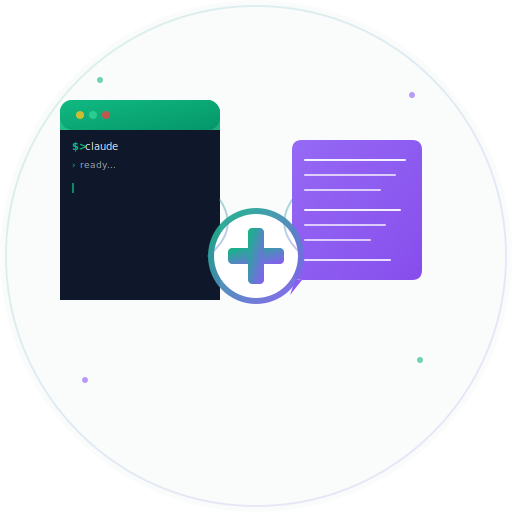

# ClaudePlus

<div align="center">



**Bidirectional mirror between Claude Code and Telegram — code anywhere, anytime**

[](https://microsoft.com/powershell)
[](LICENSE)
[](https://microsoft.com/windows)

</div>

---

## Overview

**ClaudePlus** is a PowerShell module that transforms Claude Code into a Telegram-controlled AI assistant. Launch Claude Code in a visible terminal window and interact with it from your phone via Telegram — perfect for hands-free coding, mobile access, or remote workflows.

Send code questions to Claude via Telegram, get clean responses back instantly. Voice messages are automatically transcribed and processed.

---

## Features

- **Telegram Bidirectional Mirror** — Send text or voice messages from Telegram, receive Claude's responses instantly
- **Hybrid Mode** — Messages appear in the visible Claude TUI terminal AND clean responses are sent to Telegram via pipe mode
- **Pipe Mode (`claude -p`)** — Uses Claude Code's non-interactive pipe mode for artifact-free response capture (no TUI noise, no encoding issues)
- **Voice Message Transcription** — Send voice messages from Telegram; they are automatically transcribed using faster-whisper with automatic language detection (99+ languages supported)
- **No Window Focus Stealing** — Uses Win32 `PostMessage WM_CHAR` to write to Claude's console without stealing focus or moving the mouse
- **Conversation Context** — Uses `--continue` flag to maintain conversation context across pipe invocations
- **Auto-Configuration** — Imports Telegram credentials from VS Extension or project config file
- **Dangerously Skip Permissions** — Auto-adds `--dangerously-skip-permissions` to Claude Code
- **4096-Character Telegram Limit** — Automatically truncates long responses for Telegram
- **Graceful Shutdown** — `/stop` command or Ctrl+C cleanly terminates the mirror
- **Auto-Install Dependencies** — Automatically installs faster-whisper, ffmpeg, and Python packages on first run

---

## How It Works

```
┌───────────────────────────────────────────────────────────────┐
│                    ClaudePlus Architecture                     │
├───────────────────────────────────────────────────────────────┤
│                                                               │
│  Telegram App              ClaudePlus Module                  │
│  (Phone/Web)               (PowerShell)                       │
│       │                         │                             │
│       │  1. User sends          │                             │
│       │     text or voice  ◄────┤  Long polling               │
│       │     message             │  (getUpdates)               │
│       │                         │                             │
│       │                    ┌────▼──────────────────────┐      │
│       │                    │  Voice? → Transcribe      │      │
│       │                    │  (faster-whisper, auto    │      │
│       │                    │   language detection)     │      │
│       │                    └────┬──────────────────────┘      │
│       │                         │                             │
│       │                    ┌────▼──────────────────────┐      │
│       │                    │  HYBRID: Send to both     │      │
│       │                    │                           │      │
│       │                    │  1. PostMessage WM_CHAR   │      │
│       │                    │     → TUI terminal        │      │
│       │                    │     (visual display)      │      │
│       │                    │                           │      │
│       │                    │  2. claude -p --continue  │      │
│       │                    │     → Pipe mode           │      │
│       │                    │     (clean response)      │      │
│       │                    └────┬──────────────────────┘      │
│       │                         │                             │
│       │  Response sent ◄────────┤  Clean UTF-8 text           │
│       │  via Telegram           │  (no TUI artifacts)         │
│       │                         │                             │
└───────┼─────────────────────────┼─────────────────────────────┘
        │                         │
   [Phone/Web]          [Windows Terminal/CMD]
```

### Hybrid Architecture

ClaudePlus uses a **dual-path** approach for each Telegram message:

1. **TUI Path** — The message is typed into the visible Claude Code terminal via `PostMessage WM_CHAR` (Win32 API). This gives you a visual display of the conversation in the terminal window. No focus stealing, no mouse movement.

2. **Pipe Path** — Simultaneously, `claude -p "<message>" --continue` is invoked as a separate process. This returns clean UTF-8 text to stdout with zero TUI artifacts. The `--continue` flag maintains conversation context across invocations.

The pipe response is what gets sent back to Telegram — guaranteed clean, complete, and properly encoded.

### Voice Transcription Pipeline

```
Telegram Voice Message
    │
    ▼
getFile API → Download OGG
    │
    ▼
faster-whisper (CPU, int8)
    │  Auto language detection
    │  99+ languages supported
    ▼
JSON {text, language, probability}
    │
    ▼
Send transcription confirmation to Telegram
    │
    ▼
Process as regular text message (hybrid mode)
```

---

## Prerequisites

### Required
- **Windows 10/11** (64-bit)
- **PowerShell 5.1+** (built into Windows)
- **Claude Code** installed (`claude.exe` in PATH or `%USERPROFILE%\.local\bin\claude.exe`)
- **Telegram Bot Token** (from BotFather)
- **Telegram Chat ID** (your personal Telegram user ID)

### Optional (Auto-Installed)
- **Python 3.x** — Required for voice transcription (auto-detected: `python`, `python3`, `py`)
- **faster-whisper** — Speech-to-text engine (auto-installed via pip on first voice message)
- **ffmpeg** — Audio codec (auto-installed via winget if missing)

### Verify Prerequisites

```powershell
# Check PowerShell version
$PSVersionTable.PSVersion

# Check Claude Code
claude --version

# Check Python (optional, for voice)
python --version
```

---

## Installation

### Step 1: Create a Telegram Bot

1. Open Telegram and search for **@BotFather**
2. Send `/newbot`
3. Choose a **name** (e.g., `My Claude Assistant`)
4. Choose a **username** ending with `bot` (e.g., `MyClaude_bot`)
5. Copy the **Bot Token** that BotFather gives you

### Step 2: Get Your Chat ID

1. Search for **@userinfobot** on Telegram and send any message
2. It will reply with your **Chat ID** (a number like `123456789`)

### Step 3: Install ClaudePlus

**Option A: Quick Install (recommended)**

```powershell
.\Install-ClaudePlus.ps1
```

**Option B: Manual Install**

```powershell
# Import the module
Import-Module .\ClaudePlus.psm1

# Configure Telegram
claudeplus-config -TelegramBotToken "YOUR_BOT_TOKEN" -TelegramChatId "YOUR_CHAT_ID"
```

### Step 4: Launch

```powershell
Import-Module .\ClaudePlus.psm1
claudeplus
```

This will:
1. Launch Claude Code in a visible `conhost.exe` terminal window
2. Initialize voice transcription (Python + faster-whisper + ffmpeg)
3. Start polling Telegram for messages
4. Send a startup confirmation to your Telegram bot

---

## Usage

### Text Messages
Simply send a text message to your Telegram bot. ClaudePlus will:
1. Display it in the Claude TUI terminal (visual)
2. Process it via `claude -p` (pipe mode)
3. Send the clean response back to Telegram

### Voice Messages
Record a voice message in Telegram. ClaudePlus will:
1. Download the audio file
2. Transcribe it using faster-whisper (auto language detection)
3. Send you a transcription confirmation with detected language and confidence
4. Process the transcribed text as a regular message

### Commands
| Command | Description |
|---------|-------------|
| `/stop` | Stop the mirror and exit ClaudePlus |

### Configuration

```powershell
# View current configuration
claudeplus-config

# Set Telegram credentials
claudeplus-config -TelegramBotToken "YOUR_TOKEN" -TelegramChatId "YOUR_ID"

# Disable dangerous permissions skip
claudeplus-config -DangerouslySkipPermissions $false

# Disable Telegram mirror (run Claude directly)
claudeplus-config -AutoTelegram $false

# Launch without Telegram
claudeplus -NoTelegram
```

---

## Configuration Sources

ClaudePlus looks for Telegram credentials in this order:

1. **ClaudePlus config** — `%LOCALAPPDATA%\ClaudePlus\config.json`
2. **Project config** — `Documents\Visual Studio 2026\FiscalIQ\Claude Code Extension\telegram-config.json`
3. **VS Extension config** — `%LOCALAPPDATA%\ClaudeCodeExtension\claudecode-settings.json`

If credentials are found in source 2 or 3, they are automatically imported into source 1.

---

## Technical Details

### Pipe Mode (`claude -p`)

Instead of reading the TUI console buffer (which contains cursor artifacts, box-drawing characters, and status bars), ClaudePlus uses Claude Code's pipe mode:

```
claude -p "your message" --continue --dangerously-skip-permissions
```

This runs Claude Code in non-interactive mode, producing clean UTF-8 text on stdout. Key details:
- `--continue` maintains conversation context across invocations
- `StandardOutputEncoding = UTF-8` ensures correct accent handling (é, è, ê, etc.)
- 3-minute timeout per invocation
- Async stdout/stderr reading to prevent deadlocks

### Win32 Console I/O

For the TUI display path, ClaudePlus uses:
- **`PostMessage WM_CHAR`** — Posts characters directly to the conhost window message queue. No focus stealing, no mouse movement, no clipboard interference.
- A compiled C# helper process handles the Win32 calls to avoid PowerShell console conflicts.

### Console Buffer Reader (Legacy)

A standalone C# exe is compiled at runtime for reading the console buffer:
- `FreeConsole()` + `AttachConsole(pid)` + `CreateFile("CONOUT$")`
- `ReadConsoleOutputCharacter()` reads the visible window area
- Used for legacy buffer reading (the pipe mode replaced this for Telegram responses)

### Voice Transcription

- **Engine**: faster-whisper (default) or openai-whisper (fallback)
- **Model**: `base` (auto-downloaded on first use, ~150MB)
- **Device**: CPU with int8 quantization (no GPU required)
- **Languages**: 99+ languages with automatic detection
- **Format**: Telegram OGG Opus → faster-whisper → JSON `{text, language, probability}`
- **Dependencies**: Auto-installed on first run (Python, faster-whisper, ffmpeg)

---

## Troubleshooting

### Claude window not found
If ClaudePlus reports "Pas de handle fenetre", the conhost window handle wasn't detected. This usually resolves itself — the module scans all `cmd.exe` processes to find the right one.

### Voice transcription fails
- Ensure Python 3.x is installed and in PATH
- Run `python -m pip install faster-whisper` manually
- Ensure ffmpeg is installed (`winget install Gyan.FFmpeg`)

### Module not reloading after changes
Always use the `-Force` flag when reimporting:
```powershell
Import-Module .\ClaudePlus.psm1 -Force
```

### Responses not appearing in Telegram
- Check that Claude Code is running in the terminal window
- Verify your Telegram Bot Token and Chat ID with `claudeplus-config`
- Check the PowerShell console for error messages

---

## Project Structure

```
ClaudePlus/
├── ClaudePlus.psm1          # Main PowerShell module (all logic)
├── Install-ClaudePlus.ps1   # Quick install script
├── README.md                # This file
├── LICENSE                  # MIT License
├── logo.svg                 # Project logo
```

---

## How It Was Built

ClaudePlus went through several architectural iterations:

1. **v1 — Console Buffer Reading**: Read Claude's TUI output via `AttachConsole` + `ReadConsoleOutputCharacter`. Worked but produced artifacts (cursor blink, box-drawing chars, status bars).

2. **v2 — TUI Cleanup**: Added extensive regex-based cleaning (Remove-TuiChars, Clean-FinalResponse) to strip Unicode artifacts. Improved but never 100% clean.

3. **v3 — Pipe Mode**: Switched to `claude -p` for response capture. Clean UTF-8 output, no artifacts, no size limits. The TUI terminal is kept for visual display only.

4. **v4 — Hybrid + Voice**: Added dual-path (TUI display + pipe response) and voice message transcription via faster-whisper.

---

## License

MIT License — see [LICENSE](LICENSE) for details.

---

## Author

**Majid** — [GitHub](https://github.com/hayefmajid)

Built as part of the [FiscalIQ](https://github.com/hayefmajid) project ecosystem.
